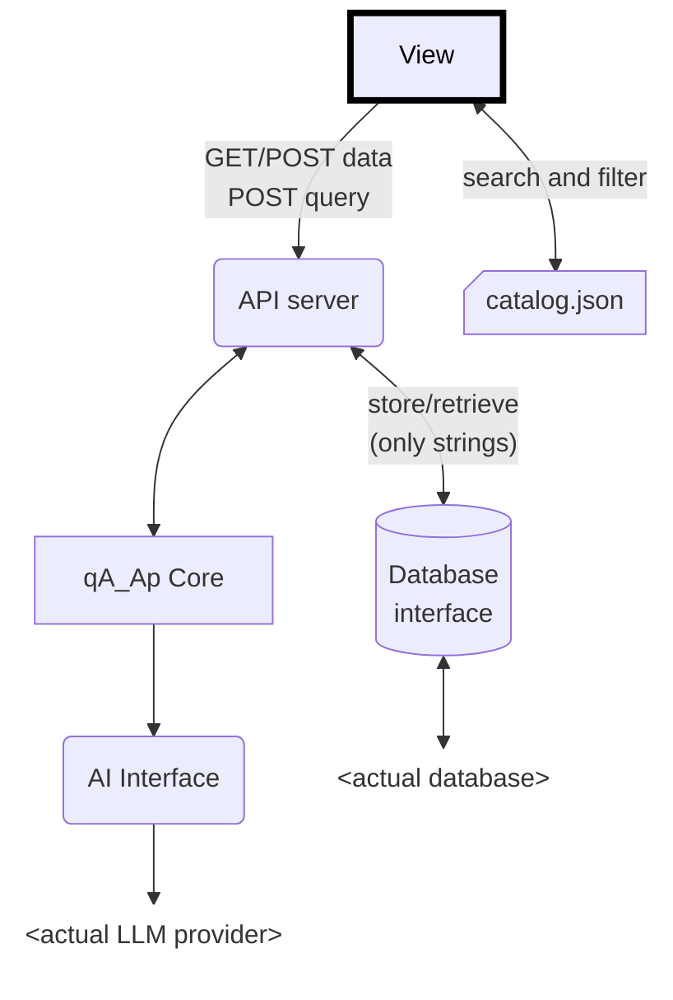

# qA_Ap 
## query About Anything package

 

## 📝 Description

This package is a simple solution for implementing a **Retrieval Augmented Generation** _(RAG)_ on custom documents. The database and LLM interfaces are modular.

Supports an all local setup with a flat file database and **Ollama** to a totally cloud based setup with a **Baserow** database and **Cerebras** _(both free to use)_.

An optional API server _(bottle.py)_ with custom authentication and an integrated frontend is available to query your documents simply and immediately.

### Architecture




## 📦 Key Dependencies

```ini
oyaml >= 1.0
numpy >= 2.3.2
sentence-transformers >= 5.0.0
semantic-text-splitter >= 0.27.0
bottle >= 0.13.4
faiss-cpu >= 1.12.0             # install faiss if your gpu is suitable
# faiss >= 1.5.3
safer >= 5.1.0                  # required if you use the FlatFileDB
ollama >= 0.5.3                 # required is you use the OllamaAIInterface
cerebras-cloud-sdk >= 1.46.0    # required if you use the CerebrasAIInterface
```

## 📁 Package Structure
```python
qA_Ap # setup method and aliases to core components

qA_Ap.app # documents manipulation methods

qA_Ap.app.catalog # Catalog related functions

qA_Ap.app.ai # internal Vectorstore class for the RAG
qA_Ap.app.ai.interfaces # abstract classes for AI interface
qA_Ap.app.ai.interfaces.ollama # Ollama interface
qA_Ap.app.ai.interfaces.cerebras # Cerebras 'personal tier' interface
qA_Ap.app.ai.methods # AI related methods

qA_Ap.classes # Document and Note classes
qA_Ap.classes.errors # application errors
qA_Ap.classes.errors.db # databse errors

qA_Ap.db # abstract class for database
qA_Ap.db.baserowfreeapi # Baserow free API database class
qA_Ap.db.flatfiledb # flat file stuctured database class

qA_Ap.state # global objects used accross the app

qA_Ap.web # controls integrated frontend view
qA_Ap.web.api # API server
```

## 🛠️ How to use

### Python Setup
1. Install Python v3.10+ _(3.12 recommended)_
2. Create a virtual environment: `python -m venv venv`
3. Activate the environment:
   - Windows: `venv\Scripts\activate`
   - Unix/MacOS: `source venv/bin/activate`
4. Install dependencies: `pip install -r requirements.txt`

### `qA_Ap.init()` method

All the setup can be made with one method call:

```python
import qA_Ap as qp

qp.init()
```

Customize your setup with these parameters:

- **database** _(str | ottoDB.ottoDB, optional)_: The database to use. Can be a path to a flat file database (uses a FlatFileDB instance) or an instance of ottoDB. Defaults to `"data/qaap_db"`.

- **ai** _(AIInterface.AIInterface | str, optional)_: The AI interface to use. Can be a model name _(if so it uses an OllamaAIInterface)_ or an instance of AIInterface. Defaults to `"qwen3:0.6b"`.

- **embeddings_model** _(str, optional)_: The embeddings model to use via SentenceTransformer. Can be a local path or HuggingFace project name. Defaults to `"Qwen3-Embedding-0.6B"`.

- **object_of_search** _(str, optional)_: The object of search. Will be replaced in the  system_prompt. Defaults to `"solutions"`.

- **system_prompt** _(str, optional)_: The system prompt to use. Defaults to `qA_Ap.default_system_prompt`.

- **api_server** _(int | dict | False, optional)_: The port on wich to run the API server (bottle.py). If a dictionary is provided, it will be used as the server configuration. If False the server is not run. Defaults to `8080`.

- **auth** _(bool, optional)_: Whether to enable authentication on the API server POST endpoints. Defaults to `False`.

- **frontend** _(bool, optional)_: Whether to run the integrated frontend interface. Defaults to `False`.

### Core objects

the `qA_Ap` package has three useful aliases:

#### qA_Ap.State

The **State** class contains globals variables used accross the app:
- **Database**: the current `qA_Ap.db.qaapDB` class instance used a database
- **AIInterface**: The current `qA_Ap.app.ai.interfaces.AIInterface` class instance used to query the LLM
- **Vectorstore**: The `qA_Ap.app.ai.VectorStore` class instance used to store embedded documents and retrieve them by similarity search

#### qA_Ap.query

The query method does the RAG and outputs the streamed response.
```python
def query(
   query: str,
   history: list[dict[str,str]] = None, 
   include_metadata: bool = False
) -> AIStreamResponse:
```

- **query**: The user prompt
- **history**: The optional chat history as a list of dict containing a key `role` that can be set to _"user"_ or _"assistant"_ and a key `content` with the corresponding message.
- **include_metadata**: Bool to includes the complete metadata of retrieved documents at the end of the stream.

**AIStreamResponse** is an iterator that wraps the LMM stream response and returns the metadata as the last chunk if enabled.

#### qA_Ap.server

The [Bottle.py](https://bottlepy.org/docs/dev/) server instance that runs the API _(and the optional integrated frontend)_


### 

## 👥 Contributing

Contributions are welcome! Here's how you can help:

1. **Fork** the repository
2. **Clone** your fork: `git clone https://github.com/Fleurman/qA_Ap.git`
3. **Create** a new branch: `git checkout -b feature/your-feature`
4. **Commit** your changes: `git commit -am 'Add some feature'`
5. **Push** to your branch: `git push origin feature/your-feature`
6. **Open** a pull request

Thank you !

## 📜 License

This project is licensed under the MIT License.
